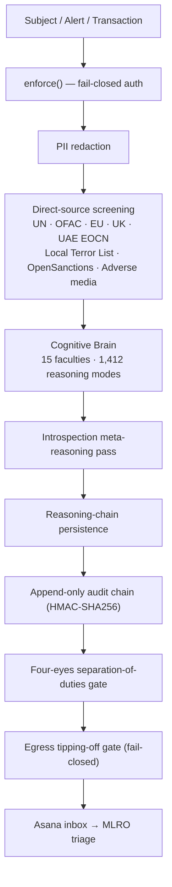

<div align="center">

# Hawkeye Sterling

### Regulator-grade AML / CFT / sanctions / PEP / adverse-media screening engine

**Built to surpass Refinitiv World-Check.**

<!-- badges:start -->


<br/>


<br/>
[](./SECURITY.md)
[](./CODE_OF_CONDUCT.md)
[](./GOVERNANCE.md)
[](./docs/adr)
<!-- badges:end -->

</div>

---

Hawkeye Sterling pairs direct-source sanctions ingestion with a first-class
cognitive engine. Every verdict is produced by named reasoning modes, across
fifteen declared faculties, and the **full reasoning chain is persisted** — no
black-box scoring. Every AI-generated output is governed by a content-frozen
compliance charter that forbids fabrication, legal conclusions, tipping-off,
and unsupported risk scoring.

<details>
<summary><strong>Table of contents</strong></summary>

- [Why Hawkeye Sterling vs Refinitiv World-Check](#why-hawkeye-sterling-vs-refinitiv-world-check)
- [Screening pipeline](#screening-pipeline)
- [Architecture invariants](#architecture-invariants)
- [The cognitive brain](#the-cognitive-brain)
- [Compliance charter (non-negotiable)](#compliance-charter-non-negotiable)
- [Source coverage](#source-coverage)
- [Delivery](#delivery)
- [Directory](#directory)
- [Getting started](#getting-started)
- [Regulatory anchors](#regulatory-anchors)
- [Governance & community](#governance--community)
- [Deployment](#deployment)
- [Licence](#licence)

</details>

---

## Why Hawkeye Sterling vs Refinitiv World-Check

| Axis | Refinitiv World-Check | Hawkeye Sterling |
|---|---|---|
| Data origin | Proprietary curation | **Direct-source ingestion** — UN, OFAC, EU, UK, UAE EOCN, UAE Local Terrorist List, OpenSanctions |
| Reasoning transparency | Black-box scoring | **Full reasoning chain** — every finding traced to the reasoning modes that produced it |
| Cognitive engine | Rule-book heuristics | **15 faculties · 1,412 reasoning modes** across 55 categories, with introspection-audited meta-reasoning pass |
| Adverse-media breadth | Curated dossiers | **5-category taxonomy** · 100+ keywords · compiled boolean query |
| UAE / emirate specificity | Generic jurisdiction tag | **UAE EOCN + Local Terrorist List** + emirate-level rules + DPMS 30 KPIs |
| Multilingual / transliteration | English-first | **Arabic & CJK** normalisation via Double-Metaphone + custom transliteration |
| False-positive handling | Manual queue | Introspection faculty — bias audit, confidence calibration, counterexample search |
| Auditability | Vendor-controlled log | **Per-decision reasoning chain + append-only audit chain persisted** |
| Report delivery | Vendor portal | **Asana inbox** — on first screening and every daily monitoring run |
| Assistant guardrails | Vendor terms | **Content-frozen compliance charter** — P1–P10 absolute prohibitions enforced |
| Cost model | Per-seat licence · opaque tiers | **Self-hostable** · no per-seat gate |

---

## Screening pipeline

Every subject flows through a fail-closed, fully-audited pipeline — from
authenticated intake to MLRO delivery — with a tipping-off egress gate on the
way out.



<details>
<summary>Plain-text pipeline (no Mermaid renderer)</summary>

```
Subject / Alert / Transaction
        │
        ▼
  enforce() ─────────────► fail-closed auth (401 unless opted-in)
        │
        ▼
  PII redaction
        │
        ▼
  Direct-source screening ─► UN · OFAC · EU · UK · UAE EOCN · Local Terror List · OpenSanctions · Adverse media
        │
        ▼
  Cognitive Brain ────────► 15 faculties · 1,412 reasoning modes · 55 categories
        │
        ▼
  Introspection pass ─────► bias · calibration · contradiction · under-triangulation
        │
        ▼
  Reasoning-chain persistence
        │
        ▼
  Append-only audit chain ► HMAC-SHA256, per-request signed
        │
        ▼
  Four-eyes gate ─────────► separation of duties, TOCTOU-protected
        │
        ▼
  Egress tipping-off gate ► fail-closed (held_review on any failure)
        │
        ▼
  Asana inbox ───────────► MLRO triage
```

</details>

---

## Architecture invariants

These hold across the platform and are enforced in CI — never broken:

- **Fail-closed auth** — every compliance route calls `enforce(req)`; anonymous callers get `401`.
- **Append-only audit chain** — `writeAuditChainEntry()` runs for every AI decision, screening result, SAR filing, and egress check.
- **Egress gate is fail-closed** — missing key, LLM failure, or parse failure returns `held_review`, never `allowed`.
- **Dual-secret JWT rotation** — zero-downtime key rotation; HS256 pinned, `alg: none` rejected.
- **Prompt hashes are CI-validated** — every system prompt is hashed and checked (FDL 10/2025 Art.18).
- **Four-eyes TOCTOU protection** — sign-off re-reads the record under write lock; never trusts in-memory state.

---

## The cognitive brain

### Fifteen faculties

Each faculty is a declared cognitive specialisation, carrying a synonym cluster
that scopes it and a bound set of reasoning modes it draws on:
**Reasoning · Data Analysis · Deep Thinking · Intelligence · Smartness ·
Strong Brain · Inference · Argumentation · Introspection · Ratiocination ·
Synthesis · Anticipation · Geopolitical Awareness · Forensic Accounting ·
Quantum Intelligence.**

### 1,412 reasoning modes across 55 categories

Reasoning modes are registered with stable IDs, named categories, bound
faculties, and a callable `apply(ctx)`. The registry holds **1,412 unique
modes** (1,456 definitions, deduplicated) spanning **55 categories** — built up
across fifteen expansion waves and version-pinned for FDL 10/2025 Art.16
governance.

Categories include: Logic · Cognitive Science · Decision Theory · Forensic ·
Compliance Framework · Legal Reasoning · Strategic · Causal · Statistical ·
Graph Analysis · Threat Modeling · Behavioral Signals · Data Quality ·
Governance · Crypto/DeFi · Sectoral Typology · OSINT · ESG · Predicate Crime ·
Proliferation · Correspondent Banking · Hawala/IVT · FTZ Risk · Professional ML ·
Regulatory AML · Technology Risk · Climate Risk · Geopolitical Risk ·
Market Integrity · Conduct Risk · Systemic Risk · Identity Fraud ·
Digital Economy · Human Rights · Asset Recovery · Intelligence Fusion ·
Quantum Computing · Behavioral Economics · Network Science ·
Cryptoasset Forensics · Corporate Intelligence · Epistemic Quality ·
Psychological Profiling · Insider Threat · and more.

### Introspection meta-reasoning pass

After findings are collected, the engine runs a self-audit pass producing
meta-findings for cross-category contradiction, under-triangulation,
over-confidence on zero score, and confidence-calibration collapse. These are
appended to `chain[]` tagged `[meta]` so they are visible to the MLRO /
regulator.

### Governance registries

The brain ships explicit, code-mirrored governance registries: **19 KRIs**
(`src/brain/kri-registry.ts`), **25 risk-appetite dimensions**
(`src/brain/risk-appetite.ts`), a regulatory-obligations register, a vendor
register, and a **46-scenario eval harness** (`src/brain/registry/eval-harness.ts`).

### Reasoning-chain persistence

Every `BrainVerdict` carries `findings[]`, a faculty-labelled `chain[]`,
`recommendedActions[]`, and a `CognitiveDepth` sidecar (faculties touched,
modes run, categories spanned, chain length). This is the audit artefact a
regulator can request — and the evidence trail your MLRO uses years later.

---

## Compliance charter (non-negotiable)

Every AI-generated output is governed by `src/policy/systemPrompt.ts`. It
cannot be paraphrased, softened, or bypassed by downstream prompts.

**P1** No unverified sanctions assertions · **P2** No fabricated adverse media
/ citations · **P3** No legal conclusions · **P4** No tipping-off content ·
**P5** No allegation-to-finding upgrade · **P6** No merging of distinct
persons/entities · **P7** No "clean" result without scope declaration ·
**P8** No training-data-as-current-source · **P9** No opaque risk scoring ·
**P10** No proceeding on insufficient information.

Match-confidence taxonomy is enforced: **EXACT · STRONG · POSSIBLE · WEAK ·
NO MATCH**. Every response carries the mandatory 7-section structure
(Subject Identifiers, Scope Declaration, Findings, Gaps, Red Flags,
Recommended Next Steps, Audit Line).

---

## Source coverage

| List | Authority |
|---|---|
| UN Consolidated List | UN Security Council |
| OFAC SDN | US Treasury (OFAC) |
| OFAC Consolidated Non-SDN | US Treasury (OFAC) |
| EU Financial Sanctions Files | European External Action Service |
| UK OFSI Consolidated List | HM Treasury — OFSI |
| **UAE EOCN Sanctions List** | UAE Executive Office for Control & Non-Proliferation |
| **UAE Local Terrorist List** | UAE Cabinet |
| OpenSanctions PEP | OpenSanctions.org |
| Adverse Media (news + RSS + CSE) | Aggregated |

---

## Delivery

- **Asana** — first-screening and every daily-monitoring report is posted to a
  configured Asana project (inbox → MLRO triage). Contract in
  `src/integrations/asana.ts`.
- **Anthropic Claude (primary) + Groq (cost fallback)** — narrative report
  generation via `src/integrations/model-router.ts`. Always prepends the
  governing `SYSTEM_PROMPT` before any task-specific role.

---

## Directory

```
hawkeye-sterling/
├── package.json, tsconfig.json
├── src/
│   ├── brain/                    cognitive engine — 15 faculties, 1,412 reasoning modes
│   │   ├── faculties.ts          faculties × synonyms × bound modes
│   │   ├── reasoning-modes.ts    reasoning-mode registry (15 waves)
│   │   ├── registry/             eval harness · adversarial probes · ingest
│   │   ├── kri-registry.ts       19 Key Risk Indicators
│   │   ├── risk-appetite.ts      25 risk-appetite dimensions
│   │   └── ...
│   ├── policy/systemPrompt.ts    content-frozen compliance charter
│   └── integrations/             Asana · model-router (Claude + Groq)
├── web/                          Next.js 16 / React 19 app + 600+ API route handlers
│   └── lib/server/               enforce · jwt · audit-chain · egress · four-eyes · metrics
├── scripts/                      prompt-hash · brain-audit · lethal-trifecta checks
├── docs/                         governance · SOC2 · incident runbooks · pen-test log
└── .github/workflows/            CI · CodeQL · Semgrep · SLSA release · nightly eval
```

---

## Getting started

Prerequisites: **Node 22+**, **npm**.

```bash
npm install
npm run typecheck         # strict TS, zero errors expected
npm test                  # vitest unit suite
npm run brain:audit       # prints registry totals, flags any dupes / gaps
```

Full local gate (typecheck + lint + tests + audit + secret scan):

```bash
npm run verify
```

---

## Regulatory anchors

- Federal Decree-Law No. 20 of 2018 (as amended, incl. FDL No. 10 of 2025 — AI governance).
- Cabinet Decision No. 10 of 2019 (as amended, incl. CR 134 of 2025).
- Cabinet Decision No. 74 of 2020 (Terrorism Lists / TFS).
- Cabinet Resolution No. 16 of 2021 (administrative penalties).
- MoE DNFBP circulars and guidance for the precious-metals sector.
- FATF Recommendations and relevant Methodology paragraphs.
- LBMA Responsible Gold Guidance (supply-chain context).

---

## Governance & community

Hawkeye Sterling is held to a regulator-grade governance bar. The decision
model, controls rationale, and contribution rules are documented and versioned —
the *why* behind the system is auditable from source control.

| Area | Document |
|---|---|
| Project governance & decision rights | [`GOVERNANCE.md`](./GOVERNANCE.md) |
| Maintainers & review ownership | [`MAINTAINERS.md`](./MAINTAINERS.md) · [`.github/CODEOWNERS`](./.github/CODEOWNERS) |
| Architecture Decision Records | [`docs/adr/`](./docs/adr) (0000–0007) |
| Contributing & local gate | [`CONTRIBUTING.md`](./CONTRIBUTING.md) |
| Code of Conduct | [`CODE_OF_CONDUCT.md`](./CODE_OF_CONDUCT.md) |
| Security policy | [`SECURITY.md`](./SECURITY.md) · [`/.well-known/security.txt`](./web/public/.well-known/security.txt) · [`SECURITY-INSIGHTS.yml`](./SECURITY-INSIGHTS.yml) |
| Threat model | [`docs/security/THREAT_MODEL.md`](./docs/security/THREAT_MODEL.md) |
| Data classification & handling | [`docs/DATA-CLASSIFICATION.md`](./docs/DATA-CLASSIFICATION.md) |
| Release process | [`RELEASING.md`](./RELEASING.md) |
| Getting help | [`SUPPORT.md`](./SUPPORT.md) |
| AI governance policy & registers | [`docs/governance/`](./docs/governance) |
| Compliance gaps (live) | [`COMPLIANCE_GAPS.md`](./COMPLIANCE_GAPS.md) |

Issues and pull requests use structured templates
([`.github/ISSUE_TEMPLATE/`](./.github/ISSUE_TEMPLATE), PR template), and changes
to control paths require code-owner review. Governance-impacting changes follow
[`GOVERNANCE.md`](./GOVERNANCE.md) §2 and are recorded as ADRs.

> **A note on confidentiality:** never include regulated data (customer PII,
> sanctions hits, SAR/STR content) or secrets in an issue, pull request, or
> discussion. See [`docs/DATA-CLASSIFICATION.md`](./docs/DATA-CLASSIFICATION.md).

---

## Deployment

Netlify serverless + standalone Docker (`Dockerfile`) + Kubernetes (`k8s/`).
Deployment happens when the project owner verifies the product is **perfect**.

---

## Licence

**Proprietary — all rights reserved.** See [`LICENSE`](./LICENSE).
This software is not open source; no licence is granted except by written
agreement with the owner.
